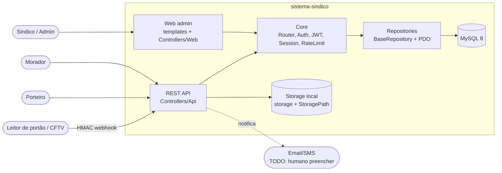
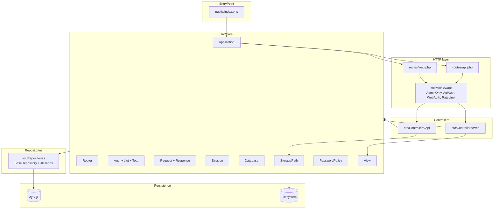

# Design — `sistema-sindico`

> Visão geral da arquitetura. Documento vivo. Decisões pontuais ficam em ADRs (`./ADR-*.md`).
> Audiência: devs novos no projeto, agents AI, revisores externos.

Stack canônica: PHP 8.2 + MySQL 8 + Playwright (E2E) + Newman/Postman (regression API). Sem framework — `src/Core/Application.php` orquestra tudo.

---

## 1. Contexto de sistema

Quem fala com quem.



> Notas:
> - O painel web e a API rodam no mesmo processo PHP (`public/index.php` boota `Application` que carrega `routes/web.php` + `routes/api.php`).
> - Não há worker assíncrono nem fila no v1: tudo é síncrono request/response.
> - O envio real de email/SMS para recuperação de senha está marcado como `TODO` em `AuthRecoveryController.php:55` — não há provedor selecionado.

---

## 2. Boundaries internos (camadas)



**Regra de dependência:** `Controllers` falam com `Core` e `Repositories`. `Repositories` só conhecem `Core/Database` (PDO). `Core` é o único acoplamento aos detalhes de runtime (PHP superglobals, sessão, JWT). Templates (`templates/`) são renderizados via `Core/View`.

---

## 3. Estrutura física do repositório

```
sistema-sindico/
public/
  index.php              entry point — boota Application e dispatcha
  assets/                CSS/JS estáticos do painel
routes/
  web.php                rotas do painel (sessão + AdminOnly)
  api.php                rotas REST (JWT via ApiAuth)
src/
  Core/                  Application, Router, Auth, Jwt, Totp, Session, Request,
                         Response, Database, View, Env, StoragePath, PasswordPolicy,
                         Autoload
  Middleware/            AdminOnly, ApiAuth, WebAuth, RateLimit
  Controllers/
    Web/                 Controllers SSR (Login, Dashboard, Module, Home)
    Api/                 37 controllers REST (Auth, Visitor, Maintenance, ...)
  Repositories/          BaseRepository + 40 repos PDO (UserRepository, ...)
  Support/               helpers utilitários
templates/
  layouts/app.php        layout master do painel
  auth/login.php         tela de login
  modules/               views por módulo (dashboard, list, perfil, unit-hub)
database/
  schema.sql             schema canônico
  seed.sql               usuários e dados de exemplo
  migrations/            001..012 — incrementais idempotentes
tests/
  api/                   coleção Postman/Newman
  e2e/                   Playwright (specs/, playwright.config.js)
scripts/
  build-hostgator-release.sh
  verify-hostgator-release.sh
  smoke-public-site.sh
.deploy-build/             saída do build de release
deploy/                    artefatos auxiliares de deploy
docs/                      diagramas, planos, prints
presentation/              materiais de apresentação
config/app.php             carrega .env e expõe config db
playwright.config.ts       config Playwright raiz (cross-browser)
public/.htaccess           rewrite Apache para o front controller
.github/workflows/         ci.yml, dod.yml, deploy-hostgator.yml, code-review.yml
```

> Dockerfile / docker-compose: TODO: humano preencher (não detectado na raiz).

---

## 4. Fluxos críticos

### 4.1 Login web (sessão)

`browser` para `POST /login` para `LoginController::submit` para `UserRepository::findByEmail` para `password_verify` para `Session::login(user)` para redirect `/`. CSRF guardado em `Session`.

### 4.2 Login API (JWT)

`mobile` para `POST /api/auth/login` para `AuthController::login`:
1. `RateLimit::enforce('login', 10, 900, ipKey(email))`.
2. `password_verify` (com dummy hash quando user não existe — mitiga timing).
3. Se `twofa_enabled`, exige `code` (Totp::verify) com rate limit 5/15min.
4. Verifica `password_history` para forçar troca pós-reset.
5. `Jwt::encode({sub, role, condominium_id, jti}, secret, 7d)`.
6. `ApiTokenRepository::register(jti)` — sessão revogável.

### 4.3 Tenant guard

Toda chamada autenticada passa por `ApiAuth::handle`:
1. Lê `Authorization: Bearer ...`.
2. `Jwt::decode` com `JWT_SECRET` (>= 32 chars, asserted no boot).
3. `UserRepository::find(sub)` para `ApiTokenRepository::isActive(jti)`.
4. Mescla user em `Auth::user()` que controllers leem para escopar SQL: `WHERE condominium_id = :cid`.

Path params como `/condominium/{c}/units/{u}/...` são checados contra `Auth::user()['condominium_id']` antes de qualquer query.

### 4.4 Webhook de portão (sem auth, com HMAC)

`leitor` para `POST /api/webhooks/access-event`:
1. `RateLimit::enforce('webhook-access', 60, 60)`.
2. Verifica timestamp dentro de janela de 300s.
3. HMAC SHA-256 com segredo do webhook.
4. `WebhookNonceRepository` deduplica.
5. Cria registro em `access_logs`.

---

## 5. Persistência

- MySQL 8 / utf8mb4 / InnoDB. Schema em `database/schema.sql`, evolução em `database/migrations/0XX_*.sql` (idempotentes via `INFORMATION_SCHEMA` para `ADD COLUMN`).
- Acesso via PDO, único provider em `src/Core/Database.php` — connection-per-request.
- `BaseRepository` define `find`, `all`, `paginate`, `insert`, `update`, `delete` parametrizados; bloqueia nomes de coluna não-alfanuméricos via `assertColumnName`.
- Sem ORM, sem migrations runtime. Migrations são SQL bruto rodado por humano/CI.

---

## 6. Segurança

- Senhas: apenas `password_hash`/`password_verify` (BCrypt). `PasswordPolicy` valida complexidade; `password_history` bloqueia reuso das últimas 5.
- JWT: HS256, `JWT_SECRET >= 32 chars`, asserted no boot (`public/index.php`). `jti` registrado em `api_tokens` e revogável no logout.
- 2FA: `Core/Totp.php` — janela +/-1 step, secret base32 em `users.totp_secret`.
- Reset de senha: código de 6 dígitos hashed (SHA-256), `attempt_count`, single-use.
- Rate limit: `Middleware/RateLimit.php` + tabela `rate_limits` (migration 011).
- CSRF web: token em sessão, validado em formulários do painel.
- Audit log: `AuditLogRepository` registra ações sensíveis com `payload` JSON e IP.
- Storage de arquivos: `StoragePath::isSafeRelative` bloqueia path traversal antes de qualquer `file_put_contents`.

---

## 7. Build, deploy e ambientes

- Local: `cp .env.example .env`, criar DB, rodar `database/schema.sql` + `seed.sql`, `php -S 127.0.0.1:8000 -t public`.
- CI: GitHub Actions (`.github/workflows/ci.yml`, `dod.yml`).
- Deploy primário: HostGator (FTP/rsync via `deploy-hostgator.yml`). Build empacotado por `scripts/build-hostgator-release.sh` em `.deploy-build/`. `scripts/verify-hostgator-release.sh` checa integridade e `scripts/smoke-public-site.sh` valida URLs públicas pós-deploy.
- Configuração: `config/app.php` lê env via closure `getenv` com default. `.env` carregado por `Core/Env.php`.

---

## 8. O que NÃO existe (e por quê)

- Sem ORM — Repositories PDO bastam para CRUD multi-tenant.
- Sem fila/worker — todo trabalho é síncrono. Email/SMS no roadmap.
- Sem cache distribuído — sem Redis/Memcached. Pode entrar quando rate limit virar gargalo (hoje em MySQL).
- Sem container oficial — Dockerfile/docker-compose não detectados; runtime alvo é HostGator. TODO: humano preencher se for adotar.
