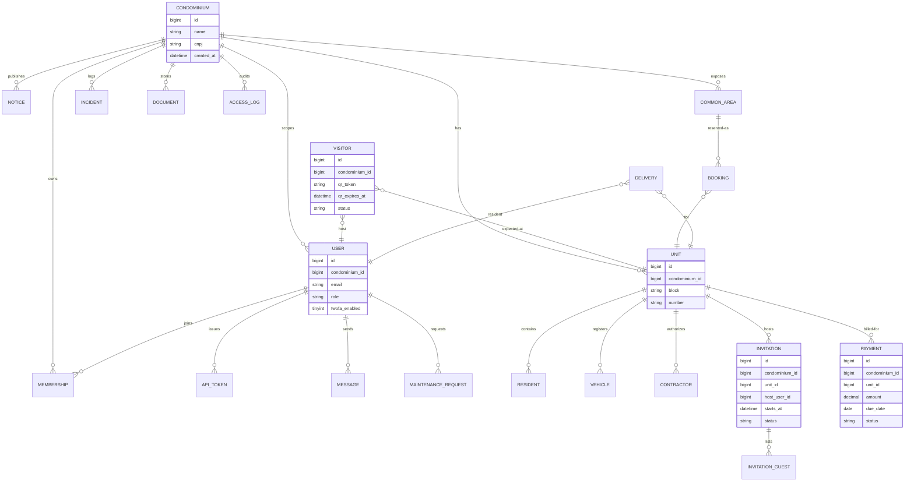

# DOMAIN — sistema-sindico

Glossário e modelo de entidades do Sistema Sindico. Quando um termo aparecer no código (variável, classe, endpoint, coluna SQL), ele deve estar aqui antes. Quando alguém perguntar "o que é X?", a resposta vem deste arquivo.

> Regra: nada de sinônimos não documentados. "Sindico" e "admin" são roles distintos; "morador" e "resident" são o mesmo conceito (apenas nomenclatura PT/EN). Os tipos canônicos seguem o ENUM de `users.role`: `admin | sindico | morador | porteiro`.

Fontes da verdade: `database/schema.sql`, `database/migrations/*.sql`, `src/Repositories/*.php`, `routes/api.php`.

---

## Glossário

| Termo | Definição | Onde aparece |
|---|---|---|
| `condominium` | Condomínio (tenant raiz). Toda tabela de domínio referencia `condominium_id`. | `condominiums`, todas as FKs |
| `unit` | Unidade habitacional (apartamento, sala, casa) dentro de um condomínio. Identificada por `(condominium_id, block, number)`. | `units` |
| `user` | Pessoa autenticável (admin, síndico, morador ou porteiro). | `users`, `routes/api.php`, `Auth::user()` |
| `membership` | Vínculo `(user, condominium, role)` que permite a mesma conta operar múltiplos condomínios. | `memberships`, `MembershipController` |
| `resident` | Cadastro civil de morador na unidade (titular, locatário, dependente). Pode ou não ter `user_id` para acesso ao app. | `residents` |
| `vehicle` | Veículo cadastrado por unidade. Placa única dentro do condomínio. | `vehicles` |
| `contractor` | Prestador de serviço autorizado a entrar via unidade, com janela de acesso. | `contractors` |
| `notice` | Aviso/comunicado publicado pelo síndico, opcionalmente fixado e com expiração. | `notices` |
| `maintenance_request` | Chamado de manutenção com prioridade e status (`aberto` to `em_andamento` to `aguardando` to `concluido`/`cancelado`), anexos e comentários. | `maintenance_requests`, `maintenance_attachments`, `maintenance_comments` |
| `payment` | Cobrança financeira por unidade com status (`pendente`, `pago`, `atrasado`, `cancelado`), `barcode` ou `pix_code`. | `payments` |
| `delivery` | Encomenda recebida na portaria (`aguardando`, `retirada`, `devolvida`). | `deliveries` |
| `visitor` | Visita pontual com `qr_token` (TTL curto), status (`previsto`, `liberado`, `dentro`, `saiu`, `expirado`, `negado`). | `visitors` |
| `invitation` | Evento programado pelo morador com vários convidados (`invitation_guests`). | `invitations`, `invitation_guests` |
| `login_invitation` | Convite para um humano criar conta (TTL 72h, token único). | `login_invitations` |
| `common_area` | Área comum reservável (salão, churrasqueira, academia). | `common_areas` |
| `booking` | Reserva de área comum num intervalo `[starts_at, ends_at]`, com checagem de conflito. | `bookings` |
| `document` | Arquivo do condomínio (atas, regulamentos, plantas), agrupado em `document_folders`, validado via `StoragePath::isSafeRelative`. | `documents`, `document_folders` |
| `message` | Mensagem interna por canal (`sindico`, `portaria`, `suporte`, `direto`). | `messages` |
| `incident` | Ocorrência operacional (briga, dano, alarme) categorizada por `incident_types` com comentários. | `incidents`, `incident_types`, `incident_comments` |
| `porter_note` | Anotação livre da portaria, opcionalmente vinculada à unidade. | `porter_notes` |
| `access_log` | Evento de entrada/saída (`in`, `out`) com resultado (`granted`, `denied`). | `access_logs` |
| `gate_trigger` | Acionamento remoto de portão registrado em `gate_trigger_logs`. | `gate_triggers`, `gate_trigger_logs` |
| `camera` | Câmera CFTV cadastrada por condomínio. | `cameras` |
| `audit_log` | Trilha imutável de ações sensíveis (`action`, `entity`, `payload`, `ip`). | `audit_logs` |
| `api_token` | Sessão JWT ativa. `jti` revogável; `expires_at` 7 dias. | `api_tokens` |
| `password_reset` | Código de recuperação (hash SHA-256, single-use, attempt counter). | `password_resets` |
| `password_history` | Últimos 5 hashes para impedir reuso. | `password_history` |
| `webhook_nonce` | Anti-replay do webhook de acesso (HMAC + janela 300s). | `webhook_nonces` |
| `notification` / `notification_preference` | Notificações por usuário e preferências por chave. | `notifications`, `notification_preferences` |
| `user_device` | Device token para push do app móvel. | `user_devices` |

---

## Entidades principais

### `condominium` (raiz multi-tenant)

- **O que é:** organização que agrupa todas as outras entidades. É o tenant.
- **Atributos chave:** `id`, `name`, `cnpj` (único), `address`, `city`, `state`, `zipcode`, `phone`, `logo_url`.
- **Ciclo de vida:** criado pelo `admin` to ativo enquanto houver `users` vinculados to soft-removido apagando registros (`ON DELETE CASCADE` propaga).
- **Quem cria:** `admin`.
- **Quem consome:** todas as queries (`WHERE condominium_id = :cid`).

### `user`

- **O que é:** pessoa autenticável. Um `user` pode ter `condominium_id` direto (caso simples) e/ou várias `memberships` (multi-condomínio).
- **Atributos chave:** `email` (único global), `password_hash` (BCrypt), `role` (`admin|sindico|morador|porteiro`), `twofa_enabled`, `totp_secret`, `last_login_at`, `password_changed_at`.
- **Ciclo de vida:** convidado via `login_invitations` to aceita token to senha definida to `active = 1` to pode rotacionar 2FA to desativado (`active = 0`) sem perda histórica.
- **Quem cria:** `admin` ou `sindico` via `POST /api/login-invitations`.

### `unit`

- **O que é:** unidade habitacional. Pertence a um `condominium`.
- **Atributos chave:** `block`, `number`, `floor`, `type`, `area_m2`, `parking_slots`. Único por `(condominium_id, block, number)`.
- **Relacionamentos:** 1:N com `residents`, `vehicles`, `contractors`, `bookings`, `payments`.

### `visitor` + `invitation`

- **O que é:** controle de quem pode entrar. `visitor` é o registro pontual (com QR token de 10min); `invitation` agrupa um evento com vários `invitation_guests`.
- **Estados visitor:** `previsto` to `liberado` to `dentro` to `saiu` (ou `expirado`/`negado`).
- **Regra de negócio:** `qr_token` é único globalmente; rotacionável via `POST /api/visitors/{id}/qr`. Check-in/out só por `porteiro` ou `admin/sindico`.

### `payment`

- **O que é:** cobrança da unidade. Permite `barcode` (boleto) e `pix_code`.
- **Estados:** `pendente` to `pago`/`atrasado`/`cancelado`.
- **Regra:** `PATCH /api/payments/{id}/pay` faz UPDATE tenant-escopado (`WHERE condominium_id = :cid AND id = :id`).

### `maintenance_request`

- **O que é:** chamado técnico. Tem `requester_id`, `assignee_id`, prioridade e fluxo de status.
- **Estados:** `aberto` to `em_andamento` to `aguardando` to `concluido`/`cancelado`.
- **Auxiliares:** `maintenance_attachments` (arquivos com `StoragePath` validado) e `maintenance_comments` (thread).

---

## Diagrama de entidades (núcleo)

Visão simplificada das relações principais. Não inclui tabelas auxiliares (preferences, devices, audit, password_history, rate_limits, webhook_nonces, gate_trigger_logs, access_logs).

---

## Convenções de domínio (reforço)

- **Tenant-first:** toda nova tabela de domínio começa com `condominium_id BIGINT UNSIGNED NOT NULL` + FK + index. Sem exceção.
- **Status em pt-BR no banco** quando o ENUM expressa fluxo de negócio visto pelo usuário (`pendente`, `pago`, `aberto`, `concluido`, `previsto`). Status técnico continua em inglês (`active`, `revoked`, `expired`).
- **Soft delete não é padrão:** maioria das relações usa `ON DELETE CASCADE` (tenant) ou `ON DELETE SET NULL` (autoria/refs cruzadas). Quando precisar preservar histórico, registrar em `audit_logs`.
