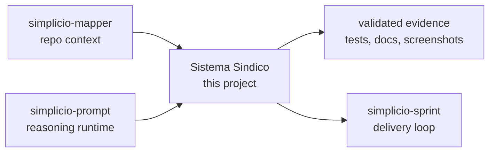

<h1 align="center">Sistema Sindico</h1>

<p align="center">
  <strong>A PHP 8.2 + MySQL condominium management system with a server-rendered admin panel and mobile-ready REST API.</strong><br />
  <em>Commands stay in English so they can be copied exactly.</em>
</p>

<p align="center">
<a href="https://github.com/wesleysimplicio/sistema-sindico/stargazers"></a>


</p>

<p align="center">
<a href="README.md">English</a> | <a href="READMEs/README.pt-BR.md">Português</a> | <a href="READMEs/README.es-ES.md">Español</a> | <a href="READMEs/README.ja-JP.md">日本語</a> | <a href="READMEs/README.ko-KR.md">한국어</a> | <a href="READMEs/README.zh-CN.md">简体中文</a> | <a href="READMEs/README.it-IT.md">Italiano</a> | <a href="READMEs/README.fr-FR.md">Français</a> | <a href="READMEs/README.ru-RU.md">Русский</a> | <a href="READMEs/README.pl-PL.md">Polski</a> | <a href="READMEs/README.hi-IN.md">हिन्दी</a> | <a href="READMEs/README.ar-SA.md">العربية</a> | <a href="READMEs/README.he-IL.md">עברית</a> | <a href="READMEs/README.ms-MY.md">Bahasa Melayu</a> | <a href="READMEs/README.id-ID.md">Bahasa Indonesia</a>
</p>


---

## The short version

A PHP 8.2 + MySQL condominium management system with a server-rendered admin panel and mobile-ready REST API.

## Quick Start

```bash
cp .env.example .env
docker compose up -d --build
curl -s http://127.0.0.1:8000/api/health
```

## What it does

- Session-based admin area for sindico/admin roles.
- JWT API prepared for residents, gate staff and future mobile clients.
- Tenant safety through condominium_id scoped domain tables.
- Docker onboarding with MySQL seed and local mail log defaults.

## Why this README is built to earn attention

- clear first-screen promise
- language links before installation
- badges and a visual hero for fast trust
- copy-ready quick start
- proof before long reference material
- star history for social proof

## How it works



## Proof and validation

- PHPUnit, Postman/Newman and Playwright flows exist for regression.
- Changelog records security, rate limit, Docker and E2E hardening.
- Mapper failed on this repo in the current run because .starter-meta.json says dotnet while the real stack is PHP; README now documents the true stack.

## Simplicio ecosystem

- [simplicio-mapper](https://github.com/wesleysimplicio/simplicio-mapper) supplies repo context before interpretation.
- [simplicio-cli](https://github.com/wesleysimplicio/simplicio-dev-cli) executes focused code tasks with verification.
- [simplicio-prompt](https://github.com/wesleysimplicio/simplicio-prompt) provides fan-out and consensus runtime patterns.
- [simplicio-sprint](https://github.com/wesleysimplicio/simplicio-sprint) turns cards into draft PR delivery loops.

## Documentation standard

- [AGENTS.md](AGENTS.md)
- [CHANGELOG.md](CHANGELOG.md)
- [docs/readme-globalization-standard.md](docs/readme-globalization-standard.md)

## Star History

<a href="https://www.star-history.com/#wesleysimplicio/sistema-sindico&Date">
  <picture>
    <source media="(prefers-color-scheme: dark)" srcset="https://api.star-history.com/svg?repos=wesleysimplicio/sistema-sindico&type=Date&theme=dark" />
    <source media="(prefers-color-scheme: light)" srcset="https://api.star-history.com/svg?repos=wesleysimplicio/sistema-sindico&type=Date" />
    
  </picture>
</a>

## License

See the repository license and distribution notes before production use.
