# Sistema Sindico

Condominium management system in **PHP 8.2 + MySQL 8**, with a server-rendered admin panel and mobile-ready REST endpoints under `/api`.

PT-BR version: [README.pt-BR.md](README.pt-BR.md).

## Features

- Session-based web admin (sindico/admin roles).
- JWT-based JSON API for the future mobile app (residents/porteiros).
- Multi-tenant: every domain table scopes by `condominium_id`.
- Modules: condominiums, units, residents, notices, maintenance, payments, deliveries, visitors, common areas, bookings, documents, messages.
- No framework dependency — minimal custom router, PDO repositories, custom HS256 JWT.

## Stack

- PHP 8.2+, PDO MySQL
- MySQL 8 (InnoDB, utf8mb4)
- Session + CSRF for the web panel
- HS256 JWT (7-day TTL) for the API
- Plain CSS in `public/assets/app.css`

## Layout

```
public/         entrypoint + static assets
routes/         web.php + api.php
src/Core/       bootstrap, router, auth, jwt, request, response, view, db
src/Controllers/Web   server-rendered admin
src/Controllers/Api   mobile-ready JSON
src/Middleware/       AdminOnly, ApiAuth, WebAuth
src/Repositories/     one per entity
templates/      layouts + module views
database/       schema.sql + seed.sql
docs/print/     UI references
```

## Requirements

- PHP 8.2+ with `pdo_mysql`
- MySQL 8+

## Setup

```bash
cp .env.example .env
# edit DB_* and JWT_SECRET
mysql -u root -p -e "CREATE DATABASE sistema_sindico CHARACTER SET utf8mb4 COLLATE utf8mb4_unicode_ci;"
mysql -u root -p sistema_sindico < database/schema.sql
mysql -u root -p sistema_sindico < database/seed.sql
php -S 127.0.0.1:8000 -t public
```

Then open:

- Web admin: <http://127.0.0.1:8000/login>
- API health: <http://127.0.0.1:8000/api/health>

## Setup via Docker

```bash
docker compose up -d --build
curl -s http://127.0.0.1:8000/api/health
```

Notes:

- App: <http://127.0.0.1:8000>
- MySQL from the host: `127.0.0.1:3307`
- Optional Redis from the host: `127.0.0.1:6380`
- DB name/user/password: `sistema_sindico` / `sistema_sindico` / `sistema_sindico`
- The first boot imports `database/schema.sql`, then every SQL file in `database/migrations/`, and finally `database/seed.sql` when the DB volume is empty.
- Default rate limit driver is `mysql`. To validate the optional Redis driver locally:

```bash
RATE_LIMIT_DRIVER=redis docker compose --profile redis up -d --build
```

- To reset the Docker database and re-apply the seed:

```bash
docker compose down -v
docker compose up -d --build
```

## Seeded credentials

All seeded users use the password `senha123`.

| Role     | Email                          |
|----------|--------------------------------|
| admin    | admin@sindico.local            |
| sindico  | sindico@sindico.local          |
| morador  | manoel@example.com             |
| porteiro | portaria@sindico.local         |

## REST API

Authenticated endpoints expect `Authorization: Bearer <jwt>` obtained from `POST /api/auth/login`. Responses follow `{ success, data, meta }`. Errors use `Response::error($msg, $status, $details, $code)` which emits `{ success: false, message, code, details }`.

### Public (no auth)

| Method | Path                                      | Notes |
|--------|-------------------------------------------|-------|
| GET    | `/api/health`                             | liveness probe |
| POST   | `/api/auth/login`                         | rate-limited 10/15min, returns `twofa_required` if 2FA enabled |
| POST   | `/api/auth/forgot-password`               | rate-limited 3/hour |
| POST   | `/api/auth/verify-code`                   | rate-limited 5/15min |
| POST   | `/api/auth/reset-password`                | enforces password policy + last-5 history |
| POST   | `/api/auth/invitations/{token}/accept`    | activate invited user |
| POST   | `/api/webhooks/access-event`              | HMAC-sha256 + timestamp window 300s, rate-limited 60/min |
| GET    | `/api/system/version`                     | `?platform=ios|android|web&current=` for force-update gate |
| GET    | `/api/system/permissions`                 | pt-BR copy for client onboarding |

### Auth & profile (Bearer)

| Method | Path                              | Notes |
|--------|-----------------------------------|-------|
| GET    | `/api/auth/me`                    | current user |
| POST   | `/api/auth/logout`                | revokes the current session jti |
| GET    | `/api/profile`                    | full profile + condo + unit |
| GET    | `/api/me`                         | alias of `/api/profile` |
| PATCH  | `/api/me`                         | update profile |
| PATCH  | `/api/me/password`                | password policy + history check |
| GET    | `/api/memberships`                | list condos the user belongs to |
| POST   | `/api/memberships/select`         | switch active membership |
| GET    | `/api/dashboard`                  | aggregated counters |

### Condominium / units / residents

| Method | Path                                                   | Notes |
|--------|--------------------------------------------------------|-------|
| GET    | `/api/condominiums`                                    | |
| GET    | `/api/condominiums/{id}`                               | |
| GET    | `/api/units`                                           | scoped by condo |
| GET    | `/api/residents`                                       | role=morador |
| GET    | `/api/condominium/{c}/units/{u}/overview`              | unit hub |
| GET    | `/api/condominium/{c}/units/{u}/residents`             | |
| POST   | `/api/condominium/{c}/units/{u}/residents`             | |
| DELETE | `/api/condominium/{c}/units/{u}/residents/{rid}`       | |
| GET    | `/api/condominium/{c}/units/{u}/vehicles`              | |
| POST   | `/api/condominium/{c}/units/{u}/vehicles`              | |
| PATCH  | `/api/condominium/{c}/units/{u}/vehicles/{vid}`        | |
| DELETE | `/api/condominium/{c}/units/{u}/vehicles/{vid}`        | |
| GET    | `/api/condominium/{c}/units/{u}/contractors`           | |
| POST   | `/api/condominium/{c}/units/{u}/contractors`           | |
| PATCH  | `/api/condominium/{c}/units/{u}/contractors/{id}`      | |
| PATCH  | `/api/condominium/{c}/units/{u}/contractors/{id}/status` | |
| DELETE | `/api/condominium/{c}/units/{u}/contractors/{id}`      | |
| GET    | `/api/condominium/{c}/porter-notes`                    | |
| POST   | `/api/condominium/{c}/porter-notes`                    | |

### Notices, maintenance, payments

| Method | Path                                       | Notes |
|--------|--------------------------------------------|-------|
| GET    | `/api/notices`                             | scope-filtered (all/block/unit/role) |
| GET    | `/api/notices/unread-count`                | personal counter |
| GET    | `/api/notices/{id}`                        | auto-marks read |
| POST   | `/api/notices`                             | admin/sindico |
| POST   | `/api/notices/{id}/attachments`            | path validated via `StoragePath::isSafeRelative` |
| POST   | `/api/notices/{id}/read`                   | |
| GET    | `/api/maintenance`                         | `?status=&priority=&unit_id=` |
| GET    | `/api/maintenance/mine`                    | requester |
| GET    | `/api/maintenance/{id}`                    | + attachments + comments |
| POST   | `/api/maintenance`                         | |
| PATCH  | `/api/maintenance/{id}`                    | admin/sindico, status transition |
| POST   | `/api/maintenance/{id}/attachments`        | |
| GET    | `/api/maintenance/{id}/comments`           | |
| POST   | `/api/maintenance/{id}/comments`           | |
| GET    | `/api/payments`                            | `?status=` |
| GET    | `/api/payments/mine`                       | resident |
| GET    | `/api/payments/summary`                    | grouped totals |
| PATCH  | `/api/payments/{id}/pay`                   | admin/sindico, tenant-scoped UPDATE |

### Visitors, invitations, deliveries, bookings

| Method | Path                                       | Notes |
|--------|--------------------------------------------|-------|
| GET    | `/api/visitors`                            | |
| GET    | `/api/visitors/mine`                       | host |
| GET    | `/api/visitors/history`                    | finalized rows |
| POST   | `/api/visitors`                            | auto QR token (10min TTL) |
| PATCH  | `/api/visitors/{id}`                       | admin/sindico/porteiro |
| POST   | `/api/visitors/{id}/qr`                    | rotate QR |
| POST   | `/api/visitors/{id}/check-in`              | porteiro |
| POST   | `/api/visitors/{id}/check-out`             | porteiro |
| GET    | `/api/visitors/qr/{token}`                 | porteiro lookup |
| GET    | `/api/invitations`                         | |
| POST   | `/api/invitations`                         | |
| GET    | `/api/invitations/{id}`                    | |
| PATCH  | `/api/invitations/{id}`                    | |
| DELETE | `/api/invitations/{id}`                    | |
| GET    | `/api/invitations/{id}/guests`             | |
| POST   | `/api/invitations/{id}/guests`             | |
| PATCH  | `/api/invitations/{id}/guests/{gid}`       | |
| DELETE | `/api/invitations/{id}/guests/{gid}`       | |
| GET    | `/api/login-invitations`                   | admin/sindico |
| POST   | `/api/login-invitations`                   | 72h TTL token |
| DELETE | `/api/login-invitations/{id}`              | only pending |
| GET    | `/api/deliveries`                          | |
| GET    | `/api/deliveries/mine`                     | resident |
| GET    | `/api/deliveries/{id}`                     | |
| POST   | `/api/deliveries`                          | porteiro |
| PATCH  | `/api/deliveries/{id}/withdraw`            | |
| GET    | `/api/common-areas`                        | |
| GET    | `/api/bookings`                            | |
| GET    | `/api/bookings/mine`                       | resident |
| POST   | `/api/bookings`                            | conflict-checked |
| PATCH  | `/api/bookings/{id}`                       | admin/sindico |

### Documents & messages

| Method | Path                                       | Notes |
|--------|--------------------------------------------|-------|
| GET    | `/api/documents`                           | `?category=` or `?folder_id=` |
| GET    | `/api/documents/{id}`                      | |
| POST   | `/api/documents`                           | path validated |
| GET    | `/api/documents/{id}/signed-url`           | HMAC-sha256, 600s TTL |
| GET    | `/api/documents/{id}/download`             | `?token=` |
| GET    | `/api/document-folders`                    | |
| GET    | `/api/document-folders/{id}`               | |
| POST   | `/api/document-folders`                    | |
| DELETE | `/api/document-folders/{id}`               | |
| GET    | `/api/messages`                            | `?channel=` |
| GET    | `/api/messages/inbox`                      | |
| POST   | `/api/messages`                            | |
| PATCH  | `/api/messages/{id}/read`                  | |

### Access control, cameras, gate, incidents

| Method | Path                                       | Notes |
|--------|--------------------------------------------|-------|
| GET    | `/api/access-logs`                         | filters: `from,to,unit_id,direction,result,type` |
| GET    | `/api/access-logs/{id}`                    | |
| GET    | `/api/cameras`                             | |
| GET    | `/api/cameras/{id}`                        | strips rtsp_url |
| GET    | `/api/cameras/{id}/stream`                 | HMAC token + namespace |
| GET    | `/api/gate-triggers`                       | excludes `auth_token` |
| POST   | `/api/gate-triggers/{id}/fire`             | SSRF-guarded outbound HTTP |
| GET    | `/api/gate-triggers/{id}/logs`             | |
| GET    | `/api/incidents`                           | `?status=&type_id=` |
| GET    | `/api/incidents/{id}`                      | |
| POST   | `/api/incidents`                           | |
| PATCH  | `/api/incidents/{id}`                      | |
| GET    | `/api/incidents/{id}/comments`             | |
| POST   | `/api/incidents/{id}/comments`             | |
| GET    | `/api/incident-types`                      | |
| POST   | `/api/incident-types`                      | admin/sindico |

### Notifications, devices, security, contact

| Method | Path                                       | Notes |
|--------|--------------------------------------------|-------|
| GET    | `/api/notifications`                       | per-user feed |
| GET    | `/api/notifications/unread-count`          | |
| POST   | `/api/notifications/{id}/read`             | |
| POST   | `/api/notifications/read-all`              | |
| GET    | `/api/notification-preferences`            | channel × event matrix |
| PUT    | `/api/notification-preferences`            | upsert |
| GET    | `/api/devices`                             | active FCM tokens |
| POST   | `/api/devices`                             | upsert by token |
| DELETE | `/api/devices/{id}`                        | revoke device |
| GET    | `/api/settings/security`                   | 2FA status |
| POST   | `/api/settings/security/2fa/setup`         | generates secret + otpauth URL |
| POST   | `/api/settings/security/2fa/enable`        | |
| POST   | `/api/settings/security/2fa/disable`       | |
| GET    | `/api/settings/sessions`                   | active jti list |
| DELETE | `/api/settings/sessions/{id}`              | revoke session |
| POST   | `/api/contact`                             | fans out to sindicos via `pushBulk` |
| GET    | `/api/contact-messages`                    | sindico inbox, `?status=` |
| GET    | `/api/contact-messages/{id}`               | auto-marks read |
| PATCH  | `/api/contact-messages/{id}`               | `action=reply\|mark_read` |

## Security posture

- **JWT** HS256 + `jti` claim; revocation via `api_tokens`. Secret rejected if shorter than 32 bytes (`Jwt::MIN_SECRET_BYTES`).
- **Rate limiting** supports `RATE_LIMIT_DRIVER=mysql|redis`; MySQL remains default for HostGator, while Redis is optional for Docker/managed-cache environments. Returns the same `X-RateLimit-*` headers plus `429 + Retry-After`.
- **Tenant isolation** every domain query joins or filters by `condominium_id`. Mutations include `WHERE condominium_id = :cid` in the UPDATE/DELETE itself.
- **SSRF** outbound gate device calls resolve hostname, reject private/reserved IPs (`FILTER_FLAG_NO_PRIV_RANGE | FILTER_FLAG_NO_RES_RANGE`), pin DNS via `CURLOPT_RESOLVE`, restrict to HTTP/HTTPS, no redirects.
- **Path traversal** every file_path validated by `StoragePath::isSafeRelative` and resolved with `realpath` boundary check against `storage/uploads/`.
- **Login timing** missing-user dummy `password_verify` keeps response time uniform.
- **Webhook** HMAC-sha256 + 300s timestamp window + 16 KB body cap.
- **Password policy** ≥8 chars, lowercase/uppercase/digit; last-5 history blocked.
- **2FA** TOTP RFC 6238 + ±1 window; login challenge gates session creation.

## Performance posture

- **Composite indexes** (`database/migrations/012_perf_indexes.sql`): `notices(condo,scope)`, `notices(condo,pinned,published_at)`, `notice_reads(user,notice)`, `payments(condo,due_date)`, `deliveries(condo,received_at)`, `visitors(condo,expected_at)`, `deliveries(unit,received_at)`, `visitors(unit,created_at)`, `users(condo,role)`.
- **Bulk notifications** `NotificationRepository::pushBulk` issues one multi-row INSERT instead of N queries.
- **Notice list** correlated subquery replaced by `LEFT JOIN notice_reads` exposing `(r.notice_id IS NOT NULL) AS is_read`.

## Database ER (core)

```mermaid
erDiagram
    condominiums ||--o{ units            : has
    condominiums ||--o{ users            : has
    condominiums ||--o{ notices          : has
    condominiums ||--o{ payments         : has
    condominiums ||--o{ deliveries       : has
    condominiums ||--o{ visitors         : has
    condominiums ||--o{ maintenance_requests : has
    condominiums ||--o{ documents        : has
    condominiums ||--o{ cameras          : has
    condominiums ||--o{ gate_triggers    : has
    condominiums ||--o{ incidents        : has
    condominiums ||--o{ contact_messages : has
    condominiums ||--o{ access_logs      : has

    units        ||--o{ users            : houses
    units        ||--o{ payments         : billed
    units        ||--o{ deliveries       : addressed
    units        ||--o{ visitors         : visited
    units        ||--o{ vehicles         : owns
    units        ||--o{ contractors      : authorizes

    users        ||--o{ api_tokens       : sessions
    users        ||--o{ user_devices     : push
    users        ||--o{ notifications    : feed
    users        ||--o{ notice_reads     : read
    users        ||--o{ password_history : last5

    notices      ||--o{ notice_reads     : tracks
    notices      ||--o{ notice_attachments : files
    maintenance_requests ||--o{ maintenance_attachments : files
    maintenance_requests ||--o{ maintenance_comments    : log
    documents    }o--|| document_folders : in
    document_folders ||--o{ document_folders : parent
    invitations  ||--o{ invitation_guests : guests
    incidents    ||--o{ incident_comments : log
    incident_types ||--o{ incidents       : classifies
    gate_triggers ||--o{ gate_trigger_logs : logs
```



## Smoke check

```bash
find src public routes templates -name '*.php' -print0 | xargs -0 -n1 php -l
php -S 127.0.0.1:8000 -t public
curl -s http://127.0.0.1:8000/api/health | jq
```

## Automation: PR conflict resolver

Workflow [`resolve-conflicts.yml`](.github/workflows/resolve-conflicts.yml) merges the PR base branch into the PR head automatically.

Triggers (either):

- Add the label `resolve-conflicts` to the PR.
- Comment `/resolve-conflicts` on the PR.

Outcomes:

- Clean merge → bot pushes the merge commit and posts a success comment.
- Conflicts → bot posts a comment listing conflicting files plus local resolution steps; workflow run fails so it is visible.

Notes:

- Uses the default `GITHUB_TOKEN` (no extra secrets).
- Cross-repo PRs require *Allow edits by maintainers*.

## Roadmap

- File upload for documents/avatars
- Real QR-code rendering
- Push notifications channel
- Mobile app (React Native or Flutter) consuming `/api`
- Refine UI from `docs/print/` mockups
