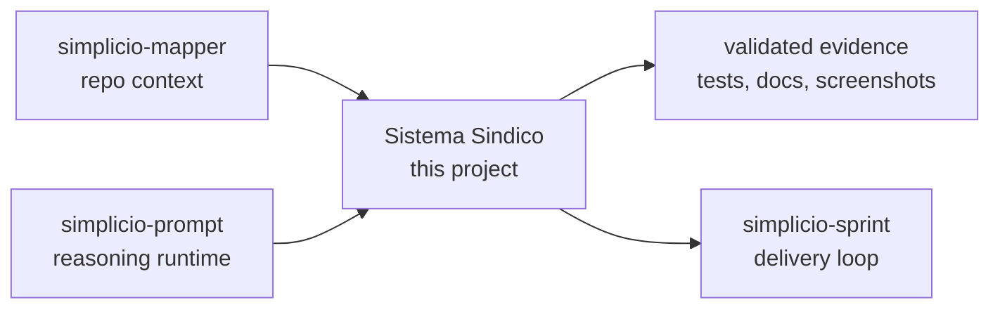

<h1 align="center">Sistema Sindico</h1>

<p align="center">
  <strong>Sistema de gestão condominial em PHP 8.2 + MySQL com painel administrativo server-rendered e API REST pronta para app mobile.</strong><br />
  <em>Os comandos ficam em inglês para poder copiar exatamente.</em>
</p>

<p align="center">
<a href="https://github.com/wesleysimplicio/sistema-sindico/stargazers"></a>


</p>

<p align="center">
<a href="README.md">English</a> | <a href="READMEs/README.pt-BR.md">Português</a> | <a href="READMEs/README.es-ES.md">Español</a> | <a href="READMEs/README.ja-JP.md">日本語</a> | <a href="READMEs/README.ko-KR.md">한국어</a> | <a href="READMEs/README.zh-CN.md">简体中文</a> | <a href="READMEs/README.it-IT.md">Italiano</a> | <a href="READMEs/README.fr-FR.md">Français</a> | <a href="READMEs/README.ru-RU.md">Русский</a> | <a href="READMEs/README.pl-PL.md">Polski</a> | <a href="READMEs/README.hi-IN.md">हिन्दी</a> | <a href="READMEs/README.ar-SA.md">العربية</a> | <a href="READMEs/README.he-IL.md">עברית</a> | <a href="READMEs/README.ms-MY.md">Bahasa Melayu</a> | <a href="READMEs/README.id-ID.md">Bahasa Indonesia</a>
</p>


---

## Resumo direto

Sistema de gestão condominial em PHP 8.2 + MySQL com painel administrativo server-rendered e API REST pronta para app mobile.

## DNA do projeto

sistema-sindico e a ancora de produto real deste workspace: gestao condominial em PHP/MySQL com papeis, pagamentos, reservas, documentos e fluxos operacionais. O README precisa parecer software que alguem consegue rodar e manter, nao so uma capa bonita; por isso o guia original de setup e dominio foi restaurado.

A primeira tela nova e a porta de entrada; o guia restaurado abaixo e a oficina. Este README precisa convencer rapido sem perder a memoria operacional que ja existia no projeto.

## Começo rápido

```bash
cp .env.example .env
docker compose up -d --build
curl -s http://127.0.0.1:8000/api/health
```

## O que faz

- Session-based admin area for sindico/admin roles.
- JWT API prepared for residents, gate staff and future mobile clients.
- Tenant safety through condominium_id scoped domain tables.
- Docker onboarding with MySQL seed and local mail log defaults.

## Por que este README foi feito para ganhar atenção

- promessa clara na primeira tela
- links de idioma antes do install
- badges e hero visual para confiança imediata
- quick start copiável
- seção de prova antes de detalhes longos
- gráfico de estrelas para social proof

## Como funciona



## Prova e validação

- PHPUnit, Postman/Newman and Playwright flows exist for regression.
- Changelog records security, rate limit, Docker and E2E hardening.
- Mapper failed on this repo in the current run because .starter-meta.json says dotnet while the real stack is PHP; README now documents the true stack.

## Ecossistema Simplicio

- [simplicio-mapper](https://github.com/wesleysimplicio/simplicio-mapper) supplies repo context before interpretation.
- [simplicio-cli](https://github.com/wesleysimplicio/simplicio-dev-cli) executes focused code tasks with verification.
- [simplicio-prompt](https://github.com/wesleysimplicio/simplicio-prompt) provides fan-out and consensus runtime patterns.
- [simplicio-sprint](https://github.com/wesleysimplicio/simplicio-sprint) turns cards into draft PR delivery loops.

## Padrão de documentação

- [AGENTS.md](AGENTS.md)
- [CHANGELOG.md](CHANGELOG.md)
- [docs/readme-globalization-standard.md](docs/readme-globalization-standard.md)

## Guia original restaurado

A secao abaixo recupera o material especifico que existia em `README.pt-BR.md` antes da passada de globalizacao. A regra daqui para frente e simples: melhorar a capa, acrescentar contexto e nunca apagar a memoria operacional.

Sistema de gestao condominial em **PHP 8.2 + MySQL 8**, com painel web administrativo renderizado no servidor e endpoints REST prontos para o futuro app mobile em `/api`.

English version: [README.md](README.md).

### Recursos

- Painel web por sessao (papeis sindico/admin).
- API JSON com JWT para o app mobile (moradores/porteiros).
- Multi-tenant: toda tabela de dominio escopa por `condominium_id`.
- Modulos: condominios, unidades, moradores, avisos, manutencao, pagamentos, encomendas, visitantes, areas comuns, reservas, documentos, mensagens.
- Sem framework — router proprio minimo, repositorios PDO, JWT HS256 proprio.

### Stack

- PHP 8.2+, PDO MySQL
- MySQL 8 (InnoDB, utf8mb4)
- Sessao + CSRF no painel web
- JWT HS256 (TTL 7 dias) na API
- CSS puro em `public/assets/app.css`

### Estrutura

```
public/         entrypoint + assets estaticos
routes/         web.php + api.php
src/Core/       bootstrap, router, auth, jwt, request, response, view, db
src/Controllers/Web   admin renderizado no servidor
src/Controllers/Api   JSON para mobile
src/Middleware/       AdminOnly, ApiAuth, WebAuth
src/Repositories/     um por entidade
templates/      layouts + views por modulo
database/       schema.sql + seed.sql
docs/print/     referencias visuais
```

### Requisitos

- PHP 8.2+ com `pdo_mysql`
- MySQL 8+

### Setup

```bash
cp .env.example .env
# editar DB_* e JWT_SECRET
mysql -u root -p -e "CREATE DATABASE sistema_sindico CHARACTER SET utf8mb4 COLLATE utf8mb4_unicode_ci;"
mysql -u root -p sistema_sindico < database/schema.sql
mysql -u root -p sistema_sindico < database/seed.sql
php -S 127.0.0.1:8000 -t public
```

Depois acesse:

- Painel web: <http://127.0.0.1:8000/login>
- Health da API: <http://127.0.0.1:8000/api/health>

### Credenciais semeadas

Todos os usuarios semeados usam a senha `senha123`.

| Papel    | Email                          |
|----------|--------------------------------|
| admin    | admin@sistemasindico.local     |
| sindico  | sindico@sistemasindico.local   |
| morador  | morador@sistemasindico.local   |
| porteiro | porteiro@sistemasindico.local  |

### API REST

Endpoints autenticados exigem `Authorization: Bearer <jwt>` obtido em `POST /api/auth/login`. Respostas seguem `{ success, data, meta }`.

Veja a tabela completa de rotas no [README.md](README.md).

### Roadmap

- Upload de arquivos para documentos/avatares
- QR-code real
- Notificacoes push
- App mobile (React Native ou Flutter) consumindo `/api`
- Refinamento visual a partir dos prints em `docs/print/`

## Histórico de estrelas

<a href="https://www.star-history.com/#wesleysimplicio/sistema-sindico&Date">
  <picture>
    <source media="(prefers-color-scheme: dark)" srcset="https://api.star-history.com/svg?repos=wesleysimplicio/sistema-sindico&type=Date&theme=dark" />
    <source media="(prefers-color-scheme: light)" srcset="https://api.star-history.com/svg?repos=wesleysimplicio/sistema-sindico&type=Date" />
    
  </picture>
</a>

## Licença

See the repository license and distribution notes before production use.
