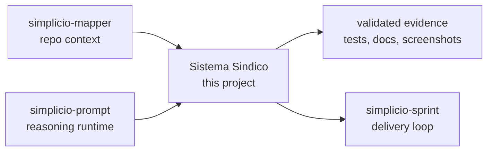

<h1 align="center">Sistema Sindico</h1>

<p align="center">
  <strong>PHP 8.2 + MySQL 기반 콘도 관리 시스템으로 서버 렌더링 관리자 패널과 모바일 준비 REST API를 제공합니다.</strong><br />
  <em>명령어는 정확히 복사할 수 있도록 영어로 유지합니다.</em>
</p>

<p align="center">
<a href="https://github.com/wesleysimplicio/sistema-sindico/stargazers"></a>


</p>

<p align="center">
<a href="../README.md">English</a> | <a href="README.pt-BR.md">Português</a> | <a href="README.es-ES.md">Español</a> | <a href="README.ja-JP.md">日本語</a> | <a href="README.ko-KR.md">한국어</a> | <a href="README.zh-CN.md">简体中文</a> | <a href="README.it-IT.md">Italiano</a> | <a href="README.fr-FR.md">Français</a> | <a href="README.ru-RU.md">Русский</a> | <a href="README.pl-PL.md">Polski</a> | <a href="README.hi-IN.md">हिन्दी</a> | <a href="README.ar-SA.md">العربية</a> | <a href="README.he-IL.md">עברית</a> | <a href="README.ms-MY.md">Bahasa Melayu</a> | <a href="README.id-ID.md">Bahasa Indonesia</a>
</p>


---

## 짧은 요약

PHP 8.2 + MySQL 기반 콘도 관리 시스템으로 서버 렌더링 관리자 패널과 모바일 준비 REST API를 제공합니다.

## 프로젝트 DNA

이 현지화 문서는 빠른 진입 경로를 유지합니다. 복원된 전체 기술 가이드는 루트 README에 있어 프로젝트의 원래 목소리와 운영 세부 정보를 보존합니다.

- Full restored guide: [../README.md](../README.md)
- Local project note: sistema-sindico is the real product anchor in this workspace: condominium management in PHP/MySQL with roles, payments, reservations, documents, and operational workflows. The README should feel like software someone can run and maintain, not only a branded shell, so the original setup and domain guide is restored.

## 빠른 시작

```bash
cp .env.example .env
docker compose up -d --build
curl -s http://127.0.0.1:8000/api/health
```

## 무엇을 하나요

- Session-based admin area for sindico/admin roles.
- JWT API prepared for residents, gate staff and future mobile clients.
- Tenant safety through condominium_id scoped domain tables.
- Docker onboarding with MySQL seed and local mail log defaults.

## 주목받는 README 구조

- 첫 화면에서 가치를 명확히 전달
- 설치 전에 언어 링크 제공
- 배지와 hero 이미지로 신뢰 형성
- 복사 가능한 quick start
- 긴 설명보다 검증을 먼저 배치
- 스타 히스토리로 social proof 제공

## 작동 방식



## 증거와 검증

- PHPUnit, Postman/Newman and Playwright flows exist for regression.
- Changelog records security, rate limit, Docker and E2E hardening.
- Mapper failed on this repo in the current run because .starter-meta.json says dotnet while the real stack is PHP; README now documents the true stack.

## Simplicio 생태계

- [simplicio-mapper](https://github.com/wesleysimplicio/simplicio-mapper) supplies repo context before interpretation.
- [simplicio-cli](https://github.com/wesleysimplicio/simplicio-dev-cli) executes focused code tasks with verification.
- [simplicio-prompt](https://github.com/wesleysimplicio/simplicio-prompt) provides fan-out and consensus runtime patterns.
- [simplicio-sprint](https://github.com/wesleysimplicio/simplicio-sprint) turns cards into draft PR delivery loops.

## 문서 표준

- [AGENTS.md](../AGENTS.md)
- [CHANGELOG.md](../CHANGELOG.md)
- [docs/readme-globalization-standard.md](../docs/readme-globalization-standard.md)

## 스타 히스토리

<a href="https://www.star-history.com/#wesleysimplicio/sistema-sindico&Date">
  <picture>
    <source media="(prefers-color-scheme: dark)" srcset="https://api.star-history.com/svg?repos=wesleysimplicio/sistema-sindico&type=Date&theme=dark" />
    <source media="(prefers-color-scheme: light)" srcset="https://api.star-history.com/svg?repos=wesleysimplicio/sistema-sindico&type=Date" />
    
  </picture>
</a>

## 라이선스

See the repository license and distribution notes before production use.
